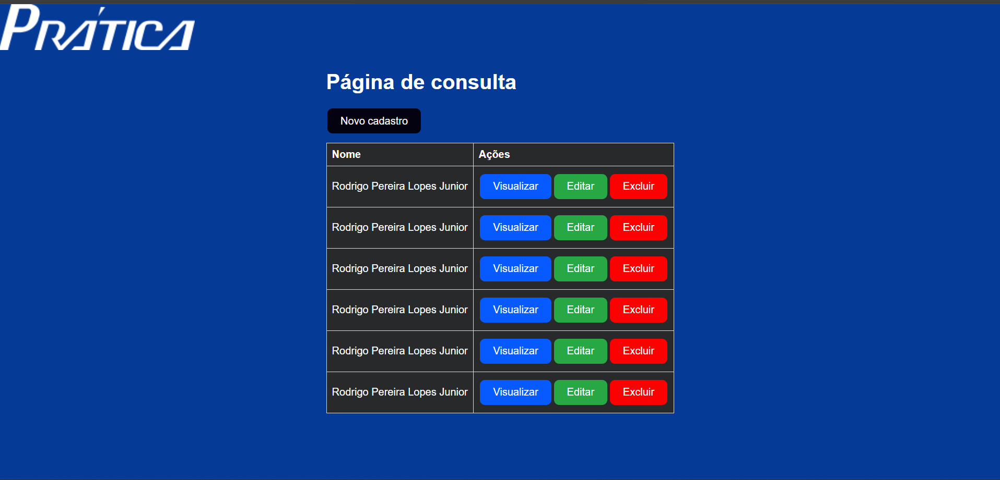

# FrontEnd - Prática

## FrontEnd created using [ReacJs](https://react.dev/learn) 

## Environment Setting

**Clone repository:**
```sh
git clone https://github.com/jrrodrigo421/https://github.com/jrrodrigo421/Technician_Management_FRONT
cd Technician_Management_FRONT
```

## Install dependencies

By default, dependencies were installed when this application was generated.
Whenever dependencies in `package.json` are changed, run the following command:

```sh
npm install
```

To only install resolved dependencies in `package-lock.json`:

```sh
npm ci
```


### `npm start`

Runs the app in the development mode.\
Open [http://localhost:3000](http://localhost:3000) to view it in your browser.

The page will reload when you make changes.\
You may also see any lint errors in the console.

### `npm test`

<br>

## Query screen:
